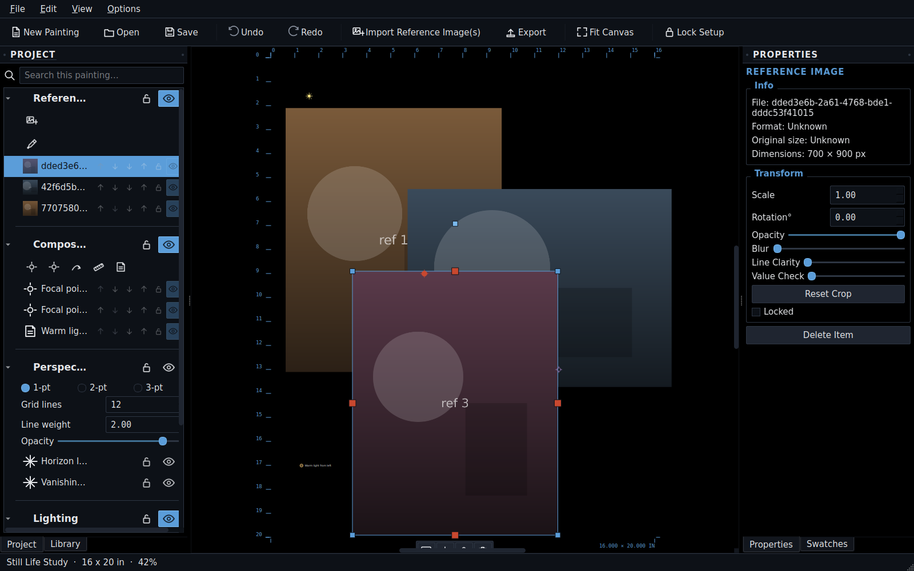
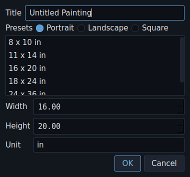
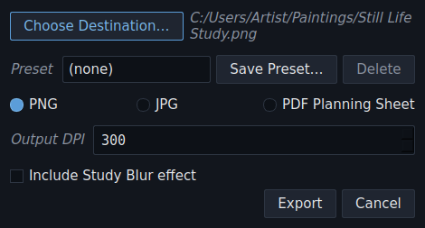
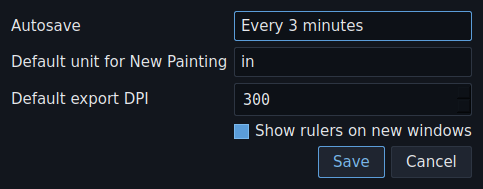
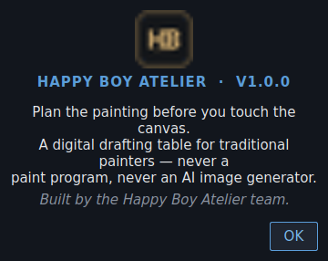

# Happy Boy Atelier

A digital drafting table for traditional painters. Plan a physical
painting before you touch the canvas: choose a format, arrange reference
photos, and work out composition, perspective, and lighting until every
decision feels settled — then take it to the easel.

See `ARCHITECTURE.md` for the technical design.

## Screenshots

The main workspace — reference photos plus the Project Panel outliner,
Properties panel, and ruler, all in the brass/graphite instrument-panel
theme:



New Painting, Export, Settings, and About — the app's other everyday
windows:

<table>
  <tr>
    <td></td>
    <td></td>
  </tr>
  <tr>
    <td></td>
    <td></td>
  </tr>
</table>

(Reference images shown above are placeholder art generated for this
README, not real photos — the app itself never generates or alters
imagery.)

## Getting started (Windows)

1. Install Python 3.10 or newer from python.org (check "Add to PATH").
2. Open a terminal in this folder and install the dependency:

   ```
   pip install -r requirements.txt
   ```

3. Launch the app:

   ```
   python main.py
   ```

## Running tests

```
pip install -r requirements-dev.txt
pytest
```

The suite runs headless and doesn't need a display, so it's safe to run
in CI or over SSH.

## Feature tour

Several tools live only as buttons inside the **Project Panel** (left
dock), not the menu bar or toolbar — worth a skim if you're looking for
something and not finding it up top.

### Getting started

- **Start screen** — on launch, pick a recent painting by its thumbnail,
  start a new one, or open something else. A fresh install goes straight
  to a blank canvas.
- **File > New Painting…** (Ctrl+N) — width, height, and unit are always
  editable; portrait/landscape/square presets just fill them in. Once
  you've saved a template, a **My Templates** list appears here too.
- **Project templates** — **File > Save as Template…** saves the current
  canvas format and guide toggles (Rule of Thirds/Golden Ratio/Inch Grid)
  under a name you choose, for reuse on future paintings. Templates never
  include reference images or composition/lighting content — just the
  blank canvas setup.
- **Import** — File > Import Reference Image(s)… (Ctrl+I), or drag image
  files onto the canvas (multiple at once is fine). Supports PNG, JPG,
  BMP, and WEBP. HEIC/HEIF isn't supported directly — convert to JPEG
  first, or use the `uploader/` tool below, which does this automatically
  for phone photos.
- **Reference Library** (dock, tabbed with the Project Panel) — a
  personal collection of images shared across all your paintings, kept
  separate from any single project file. Add images with the library's
  own button, then drag or double-click a thumbnail to bring it into the
  current painting. Searchable by name; remove an entry without touching
  the original file on disk. Photos sent from **Options > Upload From
  Phone…** (see below) appear here automatically, live, with no import
  step needed.

### Reference images

Each imported photo is its own object:

- **Drag** to move — snaps to the canvas center, another image's center,
  an active guide intersection, or edge-to-edge against the canvas or
  another image. Hold **Alt** to skip snapping.
- **Selection toolbar** — selecting a single item shows a small floating
  toolbar beneath it with Duplicate, Flip Horizontal, Lock, and Delete,
  so common actions stay close at hand.
- **Resize** via the corner handles — free by default, hold **Shift** to
  lock the aspect ratio.
- **Rotate** via the handle above the image; snaps to level/90°/180°/270°
  when you get close, for squaring up a photo without fighting a fiddly
  freehand angle. Hold **Shift** for a hard snap to 15° increments
  instead (finer control); hold **Alt** to rotate completely freely with
  no snapping at all.
- **Crop** by dragging any edge handle inward — no separate crop mode.
  Properties panel has a "Reset Crop" button to undo it.
- **Flip Horizontal / Vertical** — right-click, or Edit menu.
- **Magnify 2× / Shrink to 50%** — one-click scaling from the context
  menu.
- **Duplicate** — Edit > Duplicate (Ctrl+D), or right-click. Works on
  multi-selections too.
- **Send to Back / Bring to Front** — right-click, or the stacking
  buttons in the Project Panel row.
- **Study Blur** — Blur and Line Clarity sliders in the Properties panel.
  A "squint test": blurs the image while sharpening dark edges, so you
  can judge shapes and values without fine detail pulling your eye. It's
  a display filter only — never baked in unless you opt in from the
  Export dialog.
- **Value Check** — a third slider that desaturates the image, for
  judging light/dark values without color. Same display-only behavior as
  Study Blur, and stacks with it. **Edit > Toggle Value Check (All
  References)** flips every visible image at once.
- **Eyedropper** — a tool button at the top of the **Swatches** dock,
  right above where its own output shows up. Hover any reference image
  to read its color live (hex, RGB, and a value/luminance percentage);
  click to pin a color to a per-project palette.

### Composition tools

Placed via buttons at the top of the Project Panel's Composition
section:

- **Focal point (primary / secondary)** — click to place a crosshair
  marker.
- **Movement line** — click, drag, click to draw an arrowed path showing
  how the eye should move through the composition.
- **Measurement** — a ruler and protractor in one. Shows live length and
  angle as you place it (e.g. `12.4 in · 37°`); hold **Shift** while
  dragging an endpoint to snap the angle to 15° increments.
- **Note** — a pin marker with an editable text label.

Any armed tool shows a crosshair cursor; **Esc** or right-click cancels
it.

### Perspective tools

Live entirely in the Project Panel's Perspective section. The layer
starts hidden until you pick a mode:

- **1-pt / 2-pt / 3-pt mode** — auto-creates the horizon line and
  matching vanishing point(s).
- **Horizon line** and **vanishing points** — draggable, or editable
  numerically in the Properties panel.
- **Grid lines** (2–48) and **line weight** — control the construction
  grid radiating from each vanishing point.
- **Opacity** slider for the whole overlay.

### Lighting tools

Also in the Project Panel, under Lighting:

- **Light source** — click to place a sunburst marker.
- **Light direction / shadow direction arrows** — click, drag, click;
  drag either end independently afterward.
- **Note** — same as composition notes, in a lighting color.

### Guides

Rule of Thirds, Golden Ratio, and a 1" Grid — three checkboxes in the
Project Panel's Guides section. Purely visual overlays, drawn on top,
nothing to select. The grid uses the canvas's real physical scale, for
the classic grid-method transfer technique, and shows up in exports
automatically.

### Selecting, organizing, and editing

- **Project Panel** (left dock) — an outliner listing every item across
  every layer, with visibility/lock toggles and a search box. Reference
  images show an actual thumbnail. Items can be reordered by dragging a
  row or with the stacking buttons.
- **Properties panel** (right dock) — edits whatever's selected. Select
  multiple items for batch opacity/scale nudges and align-to-edge
  buttons.
- **Right-click** an item for its context menu — delete, lock, and (for
  reference images) flip, scale, and duplicate.
- **Ctrl+K** — a command palette covering every menu action, including
  the easy-to-forget ones.

### Workspace

- **Pan** — hold Space and drag, or use the middle mouse button.
- **Zoom** — mouse wheel, 5%–2400%; View menu for Zoom In/Out or Fit
  Canvas.
- **Rulers** — on by default (View > Show Rulers). The canvas corners
  also carry trim marks and a readout of the canvas's real dimensions.
- **Focus Mode** — View > Focus Mode (Ctrl+Shift+F) hides the toolbar and
  every dock so only the canvas remains, for stepping back and just
  looking at the arrangement. The desk goes fully transparent for the
  duration — a real window into whatever's behind the app, not a fill
  color — while the painting itself stays fully visible. A **Window
  Opacity** slider also appears in the status bar, dimming the whole
  window (painting included) if you want to see through more than just
  the desk. Everything restores exactly on exit.
- **Desk Color** — View > Change Desk Color… sets the void behind the
  canvas, saved per project.

### Locking

- **Per-item / per-layer locks** — padlock icons in the Project Panel.
  Locked content stays visible but stops being draggable or selectable.
- **Edit > Lock Setup** (Ctrl+L) — a global lock for when the plan is
  final. Freezes everything, disables the Project Panel, and shows a
  "SETUP LOCKED" banner. Not part of undo/redo.

### Saving, opening, and crash recovery

- **File > Save / Save As / Open / Open Recent** — projects are single
  portable `.atelier` files with everything embedded, safe to move or
  send.
- **Crash recovery** — the app autosaves periodically while there's
  unsaved work. If it didn't exit cleanly last time, the next launch
  offers to recover that snapshot.

### Exporting

**File > Export…** (Ctrl+E), one panel, with the destination pre-filled
and updated live as you change format:

- **Presets** — save a Format/DPI/Study Blur combo under a name for
  exporting a batch of paintings the same way.
- **PNG or JPG** at a chosen output DPI (72–1200).
- **PDF Planning Sheet** — canvas render plus a printed list of your
  composition and lighting notes, meant to bring to the easel.
- **Include Study Blur effect** — off by default; bakes the current
  Blur/Line Clarity/Value Check settings into that export only.

### Appearance

View > Appearance offers Light, Dark, Current (matches OS), and Hack
Mode, a developer theme with extra debug tools.

### Options

- **Options > Settings…** — a few standard defaults you can customize:
  autosave interval (or turn it off entirely), the unit New Painting
  starts with, the DPI Export starts with, whether new windows show
  rulers by default, Futuristic UI accents (below), and whether the app
  checks for a newer version on startup. All are pure workflow
  preferences — nothing here is saved into any painting, and changing
  one only affects what happens *next* (a future New Painting, a future
  Export, a future autosave tick), never anything already open or
  already exported. Autosave and the accents toggle take effect
  immediately; the others apply the next time that dialog/window opens.
- **Options > Upload From Phone…** — see below.
- **Options > About Happy Boy Atelier** shows the app's version and
  mission statement.

**Futuristic UI accents** (on by default, toggle in Settings) is a small
set of motion/glow touches layered on top of the regular brass/graphite
look, not a replacement for it: a soft breathing glow on whichever
placement tool is currently armed in the Project Panel, an eased fade-in
for the resize/rotate handles when you select something (and for docks
restored after Focus Mode), and softened, curved rendering for movement
lines instead of hard straight segments. Every one of these has a plain,
instant equivalent when the setting is off — nothing is gated behind it,
only the animation/softening around it.

**Checking for updates** (on by default, toggle in Settings) is a single
quiet check against this app's GitHub releases each time it starts —
nothing downloads or installs automatically. If a newer version exists,
a dismissible note appears in the status bar with a link to it; nothing
appears at all otherwise (no internet, no newer version, GitHub
unreachable — all handled the same way, silently). Dismissing a note
means you won't see it again for that specific version, but a later
release still gets its own note.

## Upload from phone

The easiest way in: **Options > Upload From Phone…** starts the uploader
for you and shows a QR code, URL, and one-time PIN right in the dialog —
no terminal needed. Scan the QR (or type the URL) from a phone on the
same WiFi network, enter the PIN, then upload photos through the
browser. Each one lands in the **Reference Library** automatically,
usually within a couple of seconds, whether or not this dialog is still
open — closing it just stops the upload server. (First time only: this
needs the uploader's own dependencies installed once — see below if it
tells you they're missing.)

Check **"Remember this device"** on the PIN screen (checked by default)
and that phone skips straight past the PIN on every future visit — no
re-entering a new PIN each time the uploader is relaunched. This is a
separate, longer-lived trust token, not an extension of the PIN itself,
so it survives the uploader restarting (each restart still generates a
fresh PIN for any new device pairing). Using a borrowed or shared phone?
Leave the box unchecked, or tap **"Forget this device"** at the bottom of
the upload page afterward to revoke it again.

If you'd rather run it by hand (or the in-app launcher can't find its
dependencies yet), `uploader/` is also a small standalone tool with its
own venv:

```
cd uploader
python -m venv .venv
.venv\Scripts\activate
pip install -r requirements.txt
python app.py
```

It prints the same URL, QR code, and PIN to the terminal. Photos still
land in `uploader/photos/` and sync into the Reference Library exactly
the same way — the in-app launcher and the manual command are two doors
into the same tool, not two different features.

Note: this relies only on a one-time PIN for access, so it's meant for a
trusted home network, not a public one. Both devices also need to be on
the same network segment — some WiFi mesh systems and phone privacy
settings can put a phone on an isolated subnet that can't reach the
laptop.

**"Port 5000 is busy"?** This almost always means a previous uploader
process is still running — the app was closed via Task Manager, crashed,
or a manual `python app.py` run was left open in a terminal — not a real
conflict with some other program. The dialog now detects this itself and
tries to shut the leftover copy down and retry automatically before
showing an error; if you still see the error message afterward, port
5000 is genuinely held by something else, and closing that (or checking
Task Manager for a leftover `python.exe`) is the fix.

## Status

**v1.0.0** was the last tagged release, covering the full MVP workflow.
Since then, a substantial UX overhaul has landed — undo/redo, crash
recovery, a real Project Panel outliner, batch editing, a command
palette, drag-and-drop import, and more. See `CHANGELOG.md` for the
itemized history and `V2_ROADMAP.md` for what's ahead.
